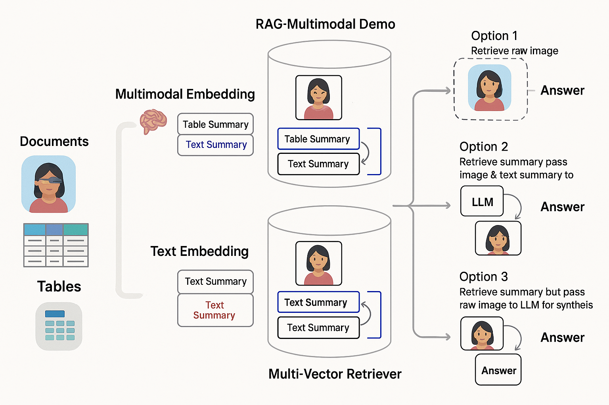
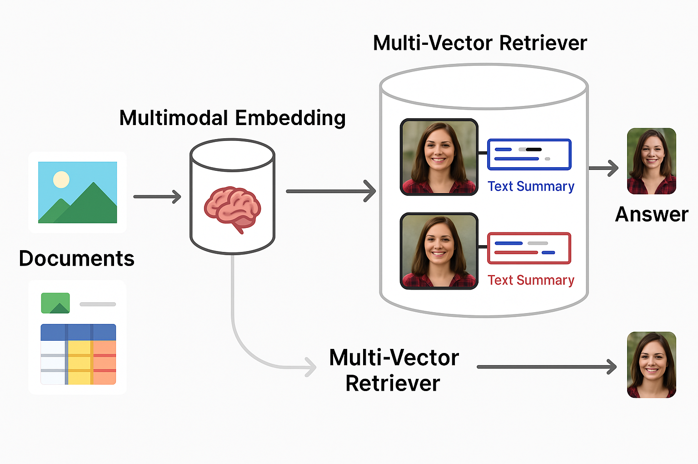

# AI-Powered Multimodal RAG System

This project implements a Retrieval-Augmented Generation (RAG) system that enables intelligent question answering from complex multimodal documents consisting of text, tables, and images. It demonstrates an extensible and modular architecture that integrates document parsing, modality-specific summarization, vector retrieval, and large language model (LLM) reasoning.

## Project Objective

To develop a production-grade pipeline that ingests documents containing multimodal content, summarizes individual modalities, stores raw and summarized vectors, and retrieves relevant data to answer natural language queries using an appropriate LLM (text-only or multimodal).

## Features

- Parse and process PDFs containing text, tables, and images
- Generate summaries per modality using LLMs or vision-language models
- Store raw content and summaries using LangChain’s Multi-Vector Retriever and ChromaDB
- Retrieve answers using three distinct RAG configurations:
  - **Option 1**: Retrieve raw image + text/table, pass to multimodal LLM
  - **Option 2**: Retrieve summaries only, pass to text LLM
  - **Option 3**: Retrieve summary + raw image, combine and pass to multimodal LLM
- Support for configuration-driven ingestion, summarization, and retrieval paths

## System Architecture

### Architecture Overview

The system supports both multimodal and text-based embeddings. Raw and summarized content is stored and retrieved through a multi-vector retriever.



### Workflow Summary

The following diagram illustrates the modular data flow across ingestion, embedding, retrieval, and synthesis phases.



## Pipeline Components

- **Ingestion**: Parses PDFs into distinct modalities using Unstructured.io and PyMuPDF
- **Summarization**: Uses LLMs to generate summaries of text, images, and tables
- **Embedding**: Raw and summarized vectors generated via OpenCLIP and OpenAI embeddings
- **Retrieval**: Multi-vector retriever using LangChain + ChromaDB
- **Synthesis**: Final response generated using GPT-4, GPT-4V, or LLaVA depending on input mode

## Technologies Used

- Python, FastAPI, Streamlit
- LangChain, ChromaDB, OpenCLIP
- GPT-4, GPT-4V, LLaVA (optional)
- Unstructured.io, PyMuPDF
- Poetry for dependency management

## Setup Instructions

1. Install dependencies:

```bash
poetry install
```

2. Set up environment variables:

```bash
cp template.env .env
# Populate with your OpenAI or HuggingFace credentials
```

3. Ingest documents:

```bash
make ingest_rag_1  # Raw modality
make ingest_rag_2  # Summarized modality
make ingest_rag_3  # Hybrid
```

4. Run the system:

```bash
make serve_backend
make serve_frontend
```

## Applications

- Visual document understanding
- Legal and financial document Q&A
- Research paper analysis
- Clinical report summarization
- Multimodal enterprise search

## Directory Structure

```
AI-Powered-Multimodal-RAG-System/
├── backend/
├── frontend/
├── app/
├── assets/
│   ├── architecture_diagram.png
│   └── rag_workflow_diagram.png
├── docs/
├── tests/
├── template.env
├── README.md
├── Makefile
└── pyproject.toml
```

## Acknowledgements

This work builds upon the foundation laid by Artefactory's RAG prototype. This version includes enhanced documentation, visualizations, and clean project structure improvements.

## Maintainer

**Harshini Pothireddy**  
[LinkedIn Profile](https://www.linkedin.com/in/harshinipr/)

